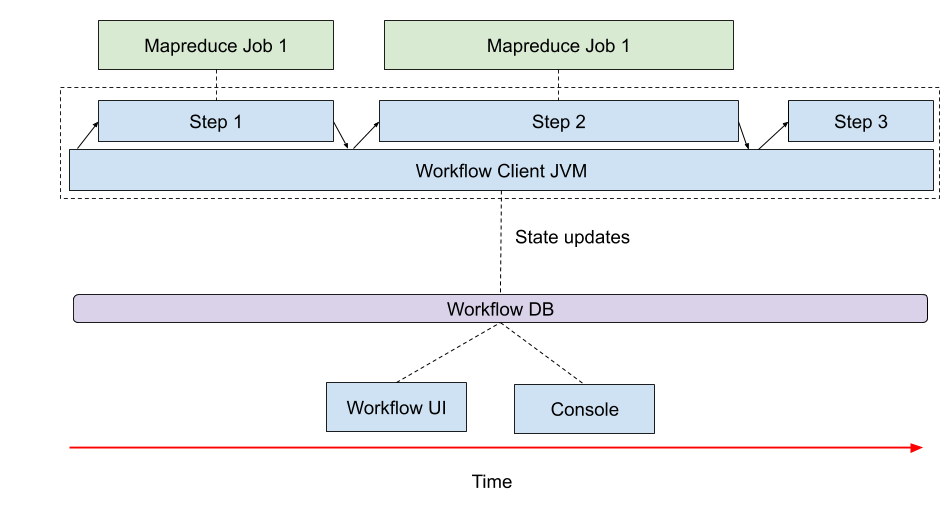
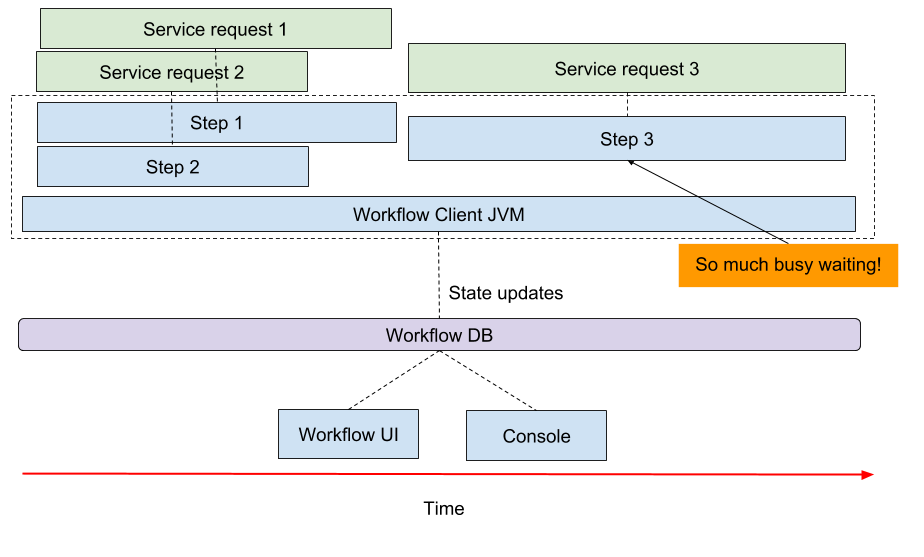
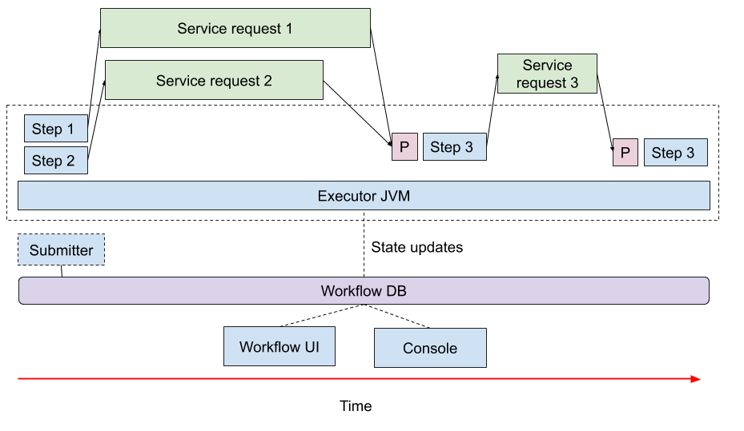

# Background Workflow

## Workflow2 "standard" model

Workflow2 was built to run a big-data pipeline, and works well in that context.  This means that a "standard" workflow consists of a series of steps which each launch a Hadoop job against a remote cluster, with  steps performing metadata operations at the head and tail of the workflow.  As a time-graph, the pipeline looks something like this:  



Workflow2 works well for this.  However, because workflows are launched as persistent JVMs, there are a number of use-cases where workflow does _not_ naturally work well: 

- As a service coordinator, where Actions wait for long-lived external requests to complete

- As a work queue; once an Execution is running, it is consuming resources

- If a workflow has enough large in-memory concurrent steps that the work needs to be distributed.

A time-graph of a workflow which acts as a coordinator for _other_ workflows might look something like this:



Waiting on external service calls requires busy-waiting, which is waste of resources.  Similarly, if a workflow needed to run 10,000 steps in parallel, a standard workflow would struggle, because the step executors aren't distributed.

## Background Workflow design

BackgroundWorkflow is a redesign of workflow2 which avoids these limitations by using persistent workers processes and "fire and forget" workflow submission.

In a BackgroundWorkflow:

- The Action implementation is distinct from the execution state (which is now stored in a __Context__)

- The workflow __Submitter__ is a distinct process from the __Executor__

- The execution state (__Context__) serialized and stored in the DB, and is only loaded into memory when a step actually executes

- Action __Preconditions__ check if an Action is ready to execute

To support this, the workflow client executor was broken into two parts:

The __Submitter__, which:

- Defines the workflow structure and input data sources
- Saves the structure and context (execution-specific data) to the database
- Is done after the workflow has been submitted

The __Executor__:

- An Executor is a persistent processes
- Running executors look for workflow Steps which are not blocked
- If a precondition allows step to execute, Executors claim and execute step
- Multiple executors can work on the same workflow concurrently (but never the _same_ step)

The same time-graph of the coordinator workflow above would look like this with a BackgroundWorkflow executor:



(not shown -- executors will run steps from multiple workflows concurrently)

(not shown -- multiple executors can make progress on the same workflow)

An example background workflow submitter looks like this:

```java
    BackgroundWorkflow initialized = BackgroundWorkflowPreparer.initialize(
        SimpleBackgroundWorkflow.class.getName(),
        new BackgroundPersistenceFactory(),
        CoreOptions.test().setScope(scope)
    );

    InitializedWorkflow.ScopedContext rootScope = initialized.getRootScope();

    SimpleWorkflowContext context = new SimpleWorkflowContext(scope);

    BackgroundStep action1 = new BackgroundStep(
        rootScope,
        "action1",
        TestAction.class,
        context
    );

    BackgroundStep action2 = new MultiStep<>(
        rootScope,
        "action2",
        context,
        new SimpleAssembly(context),
        Sets.newHashSet(action1)
    );

    BackgroundStep action3 = new BackgroundStep(
        rootScope,
        "action3",
        BlockUntil.class,
        DateTime.now().plusMinutes(30).getMillis(),
        Duration.ofMinutes(5),
        Sets.newHashSet(action2)
    );

    BackgroundWorkflowSubmitter.submit(
        initialized,
        Lists.newArrayList(action3)
    );

```

The full example can be found [here](workflow_examples/background/SimpleBackgroundWorkflow.java).  This code

- Creates a `context` for the workflow -- this is the work that _this specific Execution_ will execute.  This type must be serializable.

- Defines a DAG of BackgroundSteps.  Instead of providing instantiated Actions to the steps, only classnames are provided -- the Actions are instantiated reflectively.  

- Submits the work via a `submit` call.  

When a BackgroundAction runs, the context object provides all the information it needs to start performing work -- in this case, a SimpleWorkflowContext:

```java
  public static class TestAction extends BackgroundAction<SimpleWorkflowContext> {

    private String variable;

    public TestAction() {
      super(new AlwaysStart<>());
    }

    @Override
    public void initializeInternal(SimpleWorkflowContext testWorkflowContext) {
      this.variable = testWorkflowContext.message;
    }

    @Override
    protected void execute() throws Exception {
      setStatusMessage(variable);
    }

  }

```

An example working Executor launcher can be found [here](workflow_examples/src/main/java/com/liveramp/workflow2/workflow_examples/background/WorkflowExamplesExecutor.java), but the code is very simple:

```java
    new BackgroundWorkflowExecutor(
        Lists.<String>newArrayList(WorkflowExamplesExecutor.class.getName()),
        10000,
        5,
        new ErrorReporter.InMemoryReporter(),
        InetAddress.getLocalHost().getHostName()
    ).start();
```

The BackgroundWorkflowExecutor is provided a list of Applications it is able to run (this is so Executors don't try to run Actions which aren't on the classpath).  Once the executor `start`s, it listens for work and runs steps as needed.

## Work in progress

BackgroundWorkflow is a work in progress.  There are known feature gaps:

- Error handling is spotty
- Logs are not adequately separated by application
- Hadoop applications are not supported yet

This documentation is also not comprehensive -- please ask questions via issues.
