# Workflow2

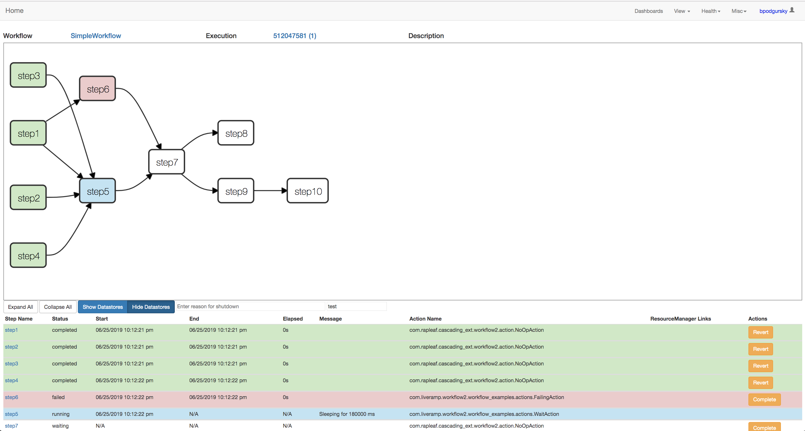
[](https://app.fossa.io/projects/git%2Bgithub.com%2Fliveandrew%2Fworkflow2?ref=badge_shield)

[](https://travis-ci.com/LiveRamp/workflow2)

Workflow2 is a DAG processing engine LiveRamp uses to help engineers quickly build failure-resilient, high performance, complex data processing pipelines.  Workflow2 was built and is actively used at LiveRamp, and now is available as Open-Source Software.

## Quick Links

[Overview](#overview)

[Concepts](#concepts)

[Hadoop integration](#hadoop-integration)

[Non-Hadoop workflows](#non-hadoop-workflows)

[Workflow UI](#workflow-ui)

[Workflow Monitor](#workflow-monitor)

[Quickstart guide](#getting-started)

[FAQ](https://github.com/liveramp/workflow2#faq)

## Overview

### Why do I need a DAG processor?  Why can't I just write code?

You can!  But if your code is launching a series of long running tasks (for LiveRamp, this usually means big-data jobs like Spark or MapReduce), stringing together those applications in a main method has drawbacks.  Running your code with a DAG processor provides a lot of features out of the box:

- **System visibility**: Humans can look at a UI to quickly see the status of the application.

- **Restartability**: If the application fails halfway through, you don't want to end in an inconsistent state or lose progress.

- **Reusability**: Sub-components of an application should be easy to share.

- **Analytics/history**: DAG frameworks capture historical timing info and failure histories.

- **Data framework integration**: Gather statistics from launched Hadoop applications and easily click through to their UIs.

- **Alerting**:  Get automatically alerted if the application fails or succeeds.

When a simple script turns into a long-running, multi-step application, it's probably time to start looking into DAG processors.

### So what is workflow2?

Workflow2 is the DAG processing framework LiveRamp uses to run almost all of its big data applications.

Workflow2 began (many, many years ago) as a simple in-memory DAG processor, and evolved into a full-featured framework for instrumenting big-data pipelines.

### What distinguishes workflow2 from other DAG processors?

- Workflow2's DAGs -- both the structure and the actual operations -- are defined in Java

- Workflow2 was built with tight Hadoop integration (with an emphasis on MapReduce, and custom bindings for Cascading and Spark) (much more on this later).  These integrations provide tools for both application developers and provide global views into shared resource (eg Hadoop cluster) utilization for operations teams.

- Workflow2 is built to support very high numbers of concurrent applications and very high parallelism

  - LiveRamp runs > 100,000 workflows per day

  - Individual workflows may have hundreds of steps, hundreds of which may be running concurrently

  - At any given time, LiveRamp is running 500-1000 concurrent, independent workflows against the same deployment

  - Workflow2 makes it easy to run multiple _copies_ of a workflow concurrently (for example, running separate workflows for each customer)

### Parts

A production deployment of workflow2 has a few moving parts:

- The __Workflow DB__ is a database which holds all system state

- The __Workflow UI__ is a web interface to allow users to view and modify system state

- The __Workflow Monitor__ is an asynchronous monitoring service which alerts users about poor-performing Hadoop applications and clients which have failed to heartbeat

- __Workflow Runner__ client processes submit and execute jobs

Each of these processes communicates exclusively through the Workflow DB instance:

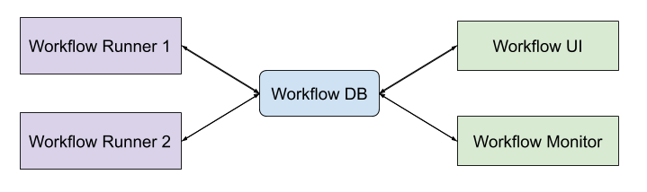

This is an important point: neither the UI or monitor need to be running for executors to submit and execute work.  The UI server is simply a UI.

## Concepts

#### Simple DAGs

_Actions_ run in a sequence defined by a DAG which is defined in user-code.  A very [simple workflow](workflow_examples/src/main/java/com/liveramp/workflow2/workflow_examples/SimpleWorkflow.java) looks like this:

```java
    Step step1 = new Step(new NoOpAction("step1"));

    Step step2 = new Step(new NoOpAction("step2"));

    Step step3 = new Step(new WaitAction("step3", 180_000), step1, step2);

    WorkflowRunners.dbRun(
        SimpleWorkflow.class.getName(),
        HadoopWorkflowOptions.test(),
        dbHadoopWorkflow -> Sets.newHashSet(step3)
    );
```

Our (very simple) Actions are [defined](workflow_hadoop/src/main/java/com/rapleaf/cascading_ext/workflow2/action/NoOpAction.java) in Java:

```java
    public class NoOpAction extends Action {
    
      public NoOpAction(String checkpointToken) {
        super(checkpointToken);
      }
    
      @Override
      protected void execute() {
        // Deliberately do nothing.
      }
    }

```

```java
    public class WaitAction extends Action {
    
      private final long delay;
      
      public WaitAction(String checkpointToken, long delay) {
        super(checkpointToken);
        this.delay = delay;
      }
    
      @Override
      protected void execute() throws Exception {
        setStatusMessage("Sleeping for "+delay+" ms");
        Thread.sleep(delay);
      }
    }
```
([source](workflow_examples/src/main/java/com/liveramp/workflow2/workflow_examples/actions/WaitAction.java))

In this graph definition, Steps 1 and 2 can execute immediately.  Step 3 waits until both Steps 1 and 2 are complete, and then executes.  If we visualize this as a DAG, it looks like this:

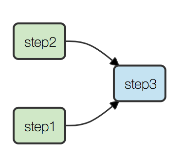

When we call _WorkflowRunners.dbRun_, we tell the framework to:

- Persist the workflow _structure_ to the database.  

- Begin executing steps, in the local process.  (To see how to execute code on remote workers, see "Background Workflow" later in this README)

When we initialize the workflow structure by invoking _WorkflowRunners.dbRun_, we create or re-use each of the following:

- We create __Step Attempts__ for every Step which will run

- We create a __Workflow Attempt__, which is conceptually "A set of steps which, if successful, will run an entire workflow"

- We either create or re-use a __Workflow Execution__.  If this is the first attempt at a workflow, create a new one.  If a previous attempt _failed_, we will re-use the previous execution.  More on this later.

- We either create or re-use an __Application__.  If this is the first time `com.liveramp.workflow2.workflow_examples.SimpleWorkflow` has ever run, we create a new Application.

Because we told Workflow2 to execute against the database (dbRun), our state is entirely backed by the database, and we can track this state in the UI.  If we navigate to the Application's page, we can see all launched Executions:

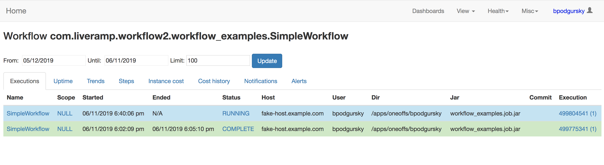

Here we can see an old, complete Execution, and a new, running one.  We can click through to find more information about a specific Execution:


We see there is a single, running, Attempt associated with this Execution.  Last, we can inspect the running Attempt: 

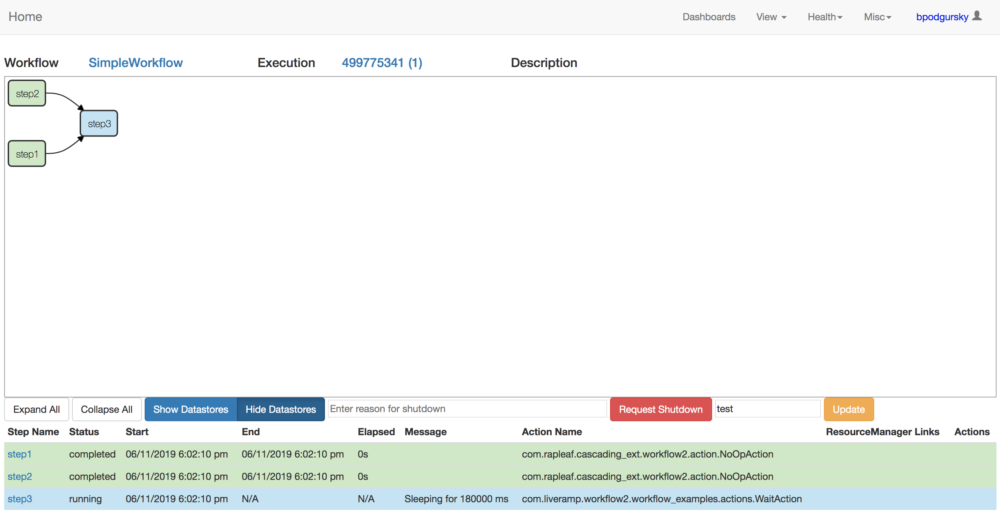

Here we see in detail the workflow we just launched.  We see it has 3 steps, and the first two have already executed; the last is still running.  

#### Resuming

This is great, but what happens if a workflow fails halfway through?  Let's say our workflow failed on the second step:

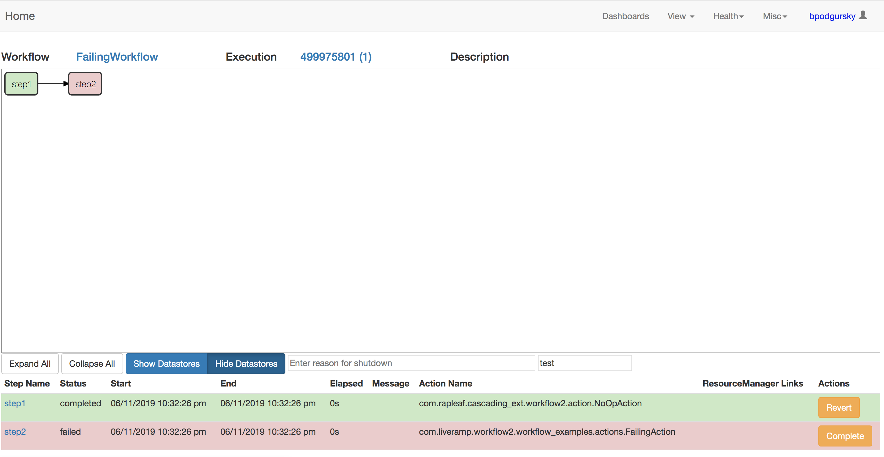

When we call `.run` on a Workflow, it either _resumes_ an incomplete Execution or creates a _new_ Execution:

- If the last Attempt did not complete the steps it defined, we create a new Attempt in the existing Execution

- If the last Attempt _did_ complete, we create a new Execution and start from the beginning.

In this case, the previous attempt failed, so the next Attempt will pick up right where we left off:

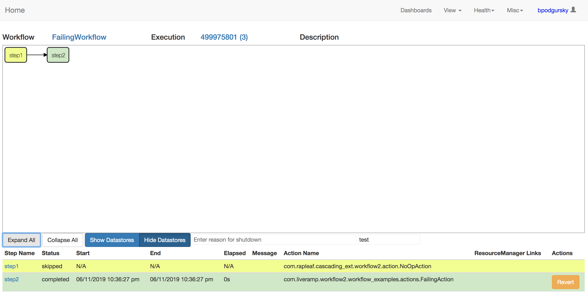

Notice that the first step was not re-executed -- it was skipped because it succeeded in the previous run.


#### Multi-Step Actions

Atomic steps are OK for simple applications, but often we want to package our Actions into larger re-usable components.  Workflow2 supports this via `MultiStepAction`s.  A MSA contains a graph of one or more Steps internally (these steps themselves can contain MSAs).  Here's a [simple example](workflow_examples/src/main/java/com/liveramp/workflow2/workflow_examples/actions/SimpleMSA.java):

```java
public class SimpleMSA extends HadoopMultiStepAction {
  
  public SimpleMSA(String checkpointToken, String tmpRoot) {
    super(checkpointToken, tmpRoot);

    Step step1 = new Step(new NoOpAction("step1"));

    Step step2 = new Step(new NoOpAction("step2"), step1);

    setSubStepsFromTails(step2);
  }

}
```

You can think of a MSA as a simple workflow -- steps can depend on each other, and the MSA binds the tails of the Action.  We can then embed this MSA into a [complete workflow](workflow_examples/src/main/java/com/liveramp/workflow2/workflow_examples/MultiStepWorkflow.java):

```java
    Step multiStep = new Step(new SimpleMSA("simple-multistep", "/tmp/dir"));

    Step tailStep = new Step(new NoOpAction("later-step"), multiStep);

    WorkflowRunners.dbRun(
        MultiStepWorkflow.class.getName(),
        HadoopWorkflowOptions.test(),
        dbHadoopWorkflow -> Sets.newHashSet(tailStep)
    );

```

When we run this workflow, the default UI view shows the steps collapsed, just like we wrote:

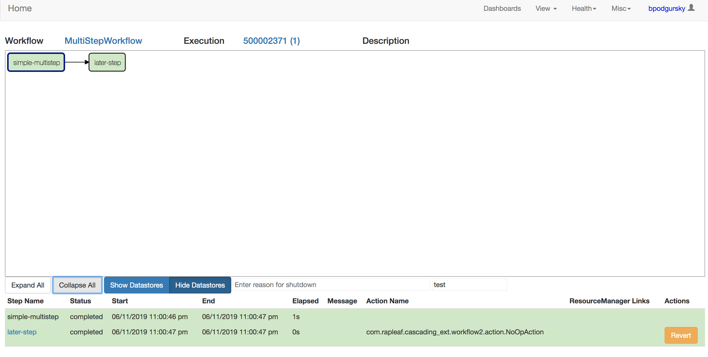

If we want to dig in to find details about the sub-steps which executed, we can expand the graph in the UI to show all component Steps:

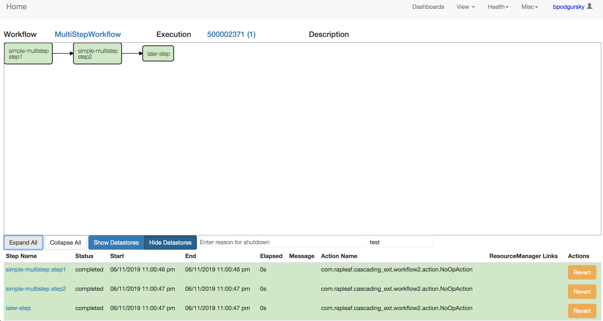

Notice that the sub-component Step names are nested with the parent name -- this way, Step names within a MSA don't have to be globally unique, only unique within the MSA.

#### Scopes

Usually, we want to be able to run multiple concurrent Executions within the same Application.  For example, if my Application is `ImportDataFromCustomer`, we want to be able to import data from customer A and customer B concurrently.  We can enable this [by adding](workflow_examples/src/main/java/com/liveramp/workflow2/workflow_examples/SimpleScopedWorkflow.java) a `scope` to the options:

```java
    Step step1 = new Step(new NoOpAction("step1"));
    Step step2 = new Step(new NoOpAction("step2"));
    Step step3 = new Step(new WaitAction("step3", 180_000), step1, step2);

    WorkflowRunners.dbRun(
        SimpleWorkflow.class.getName(),
        HadoopWorkflowOptions.test()
            .setScope(args[0]),
        dbHadoopWorkflow -> Sets.newHashSet(step3)
    );

``` 

__Only one Execution can run concurrently with a particlar scope__-- concurrent Executions are detected at startup, and fail loudly.  Usually this guarantee is important for maintaining data consistency, for example if a workflow uses a temporary directory scoped to a particular ID.

Now that we have set a scope, we can run many copies of this Application concurrently:

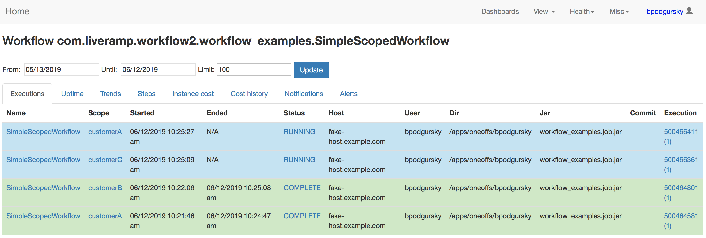

#### Resources

Beacuse we need to be able to resume a workflow when it fails, Steps cannot pass data to each other in-memory -- that data will be gone when the workflow resumes in a new JVM.  To persist local variables between steps, we need to use a `Resource`.  Actions can either `set` or `get` Resources:

```java
public class ResourceWriteAction extends Action {

  private final WriteResource<String> writeResource;

  public ResourceWriteAction(String checkpointToken,
                             Resource<String> toWrite) {
    super(checkpointToken);
    this.writeResource = creates(toWrite);
  }

  @Override
  protected void execute() throws Exception {
    set(writeResource, "Hello World!");
  }

}
```
([source](workflow_examples/src/main/java/com/liveramp/workflow2/workflow_examples/actions/ResourceWriteAction.java))and
```java
public class ResourceReadAction extends Action {

  private final ReadResource<String> toRead;

  public ResourceReadAction(String checkpointToken, Resource<String> toRead) {
    super(checkpointToken);
    this.toRead = readsFrom(toRead);
  }

  @Override
  protected void execute() throws Exception {
    setStatusMessage("Found resource value: "+ get(toRead));
  }
}

```
([source](workflow_examples/src/main/java/com/liveramp/workflow2/workflow_examples/actions/ResourceReadAction.java)) In the workflow definition, we use a `ResourceDeclarer` to declare the shared resource, and then pass the Resource [to the Actions](workflow_examples/src/main/java/com/liveramp/workflow2/workflow_examples/ResourcesWorkflow.java):

```java
    WorkflowRunners.dbRun(
        ResourcesWorkflow.class.getName(),
        HadoopWorkflowOptions.test()
            .setResourceManager(ResourceManagers.defaultResourceManager()),

        dbHadoopWorkflow -> {

          Resource<String> emptyResource = dbHadoopWorkflow.getManager().emptyResource("value-to-pass");

          Step resourceWriter = new Step(new ResourceWriteAction(
              "write-resource",
              emptyResource
          ));

          Step resourceReader = new Step(new ResourceReadAction(
              "read-resource",
              emptyResource
          ), resourceWriter);

          return Collections.singleton(resourceReader);

        }
    );

```

(the `dbHadoopWorkflow` is an `InitializedWorkflow` -- it is created when the workflow is initialized, and lets us interact with the database when the workflow structure is being built.)

When we run the workflow, we can see the value is passed:

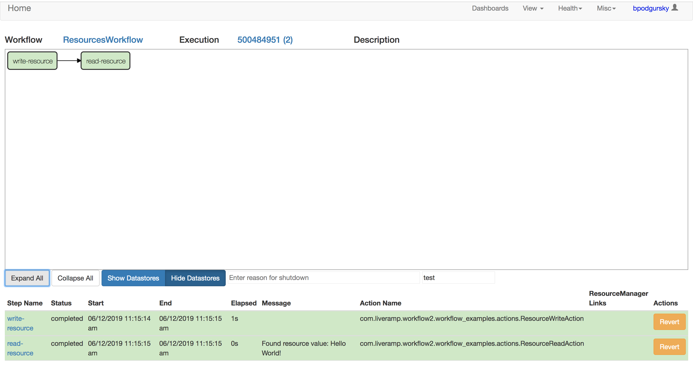

Note that this would work _even if the second step had failed on its first Attempt_.


#### Died Unclean

Ideally, when a workflow dies, it is able to shut itself down gracefully and mark itself as FAILED.  In the real world, this doesn't always happen -- machines die, processes are OOM killed, people trip on network cables, so on and so forth.  In these cases, Attempts stop heartbeating and drop into a state called DIED_UNCLEAN on the UI:

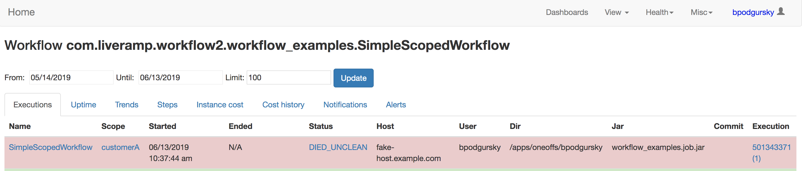

This _does not mean that the process has necessarily died_ -- it just means it cannot connect to the database.  However, to avoid hanging forever, Workflow2 treats DIED_UNCLEAN workflows as FAILED.  The next Attempt will mark the timed-out attempt as FAILED and resume where it left off.  


## Hadoop integration

[Cascading](https://www.cascading.org/) is LiveRamp's weapon of choice for orchestrating MapReduce jobs, so this README will focus on Cascading integration; however, integrations also exist for raw [MapReduce jobs](https://github.com/LiveRamp/cascading_ext/blob/master/src/main/java/com/liveramp/cascading_tools/jobs/TrackedJob.java) and [Spark](workflow_hadoop/src/main/java/com/liveramp/spark_lib/workflow/SparkTrackedOperation.java), and are easy to write for other frameworks.

By integrating our workflow orchestration with our Hadoop orchestration we are able to make job submission easy, provide visibility into running jobs, and gather statistics to monitor both job and cluster health.

#### Job Submission

Launching a Cascading workflow via an Action is very simple.  Provide the Pipes and Taps, and the Action [handles the rest](workflow_examples/src/main/java/com/liveramp/workflow2/workflow_examples/actions/SimpleCascadingAction.java):

```java
public class SimpleCascadingAction extends Action {

  private final TupleDataStore input;

  public SimpleCascadingAction(String checkpointToken, TupleDataStore input) {
    super(checkpointToken);

    this.input = input;
    readsFrom(input);
  }

  @Override
  protected void execute() throws Exception {

    Pipe pipe = new Pipe("pipe");

    completeWithProgress(buildFlow().connect(
        input.getTap(),
        new NullTap(),
        pipe
    ));

  }
}

```

Using a dummy action to [create a file](workflow_examples/src/main/java/com/liveramp/workflow2/workflow_examples/actions/SimpleWriteFile.java), we can run a simple workflow:

```java
    TupleDataStore store = new TupleDataStoreImpl("Temp Store",
        "/tmp/simple-cascading-flow/", "data",
        new Fields("line"),
        TextLine.class
    );

    WorkflowRunners.dbRun(
        SimpleCascadingFlow.class.getName(),
        HadoopWorkflowOptions.test(),
        dbHadoopWorkflow -> {

          Step writeFile = new Step(new SimpleWriteFile("write-data", store));

          Step readFile = new Step(new SimpleCascadingAction("read-data", store), writeFile);

          return Collections.singleton(readFile);
        }
    );

```

We get a few things for free now.  First, if we look at the Attempt page:


We get a link directly to the job on the ResourceManager.  Second, we've recorded all the counters from the job:


If this job runs more than once, we can now track the counters over time.  By navigating to the application page (which can also be filtered per-scope), we can see their history:

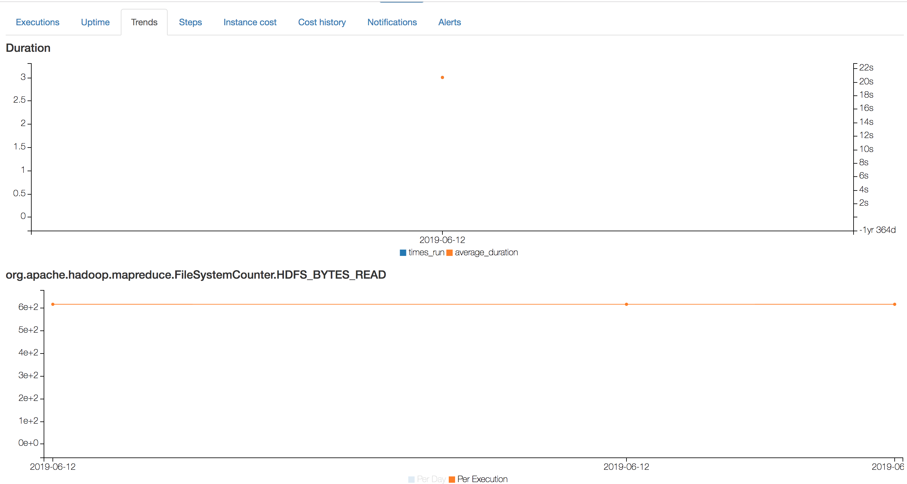

This lets us quickly answer questions like "Is this application reading or writing more data than yesterday?"  Or more often, "Is this application using more CPU and memory than yesterday?":

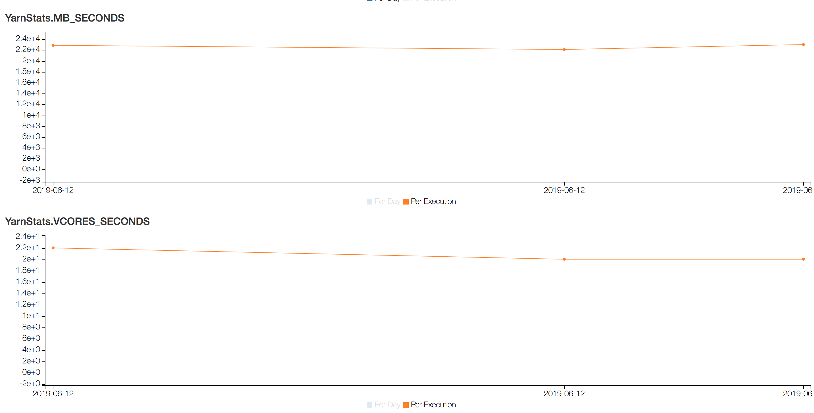

(YarnStats are a bonus added by our Cascading integration -- these track the total resources allocated to a YARN container, which includes setup time _not_ captured in MapReduce counters).

#### DataStores

Notice that in the above workflow, Steps "write-data" and "read-data" pass data via a TupleDataStore.  Because these steps mark their input and output using `readsFrom` and `creates`, we can track the dataflow on our workflow graph in the UI:

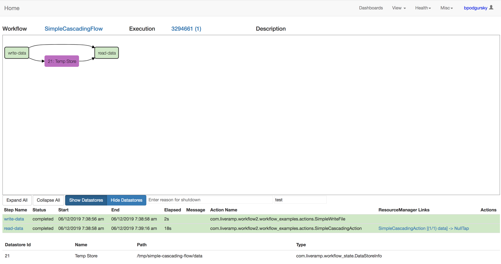

(by selecting "Show Datastores")

__Important__: because the Action `SimpleWriteFile` marked `output` as `creates`, it means this DataStore will be __deleted__ before the step runs:


```java
  public SimpleWriteFile(String checkpointToken, TupleDataStore output) {
    super(checkpointToken);
    this.output = output;
    creates(output);
  }
```

This is a very useful feature -- it means we don't have to clear temporary directories every time the workflow runs -- but can be dangerous if mis-used.

#### Properties

The `HadoopWorkflowOptions` object gives us many useful hooks to configure workflow performance.  One of the most commonly used ones is `addWorkflowProperties`, which we can use to attach arbitrary Hadoop properties to _every_ job launched [within the workflow](workflow_examples/src/main/java/com/liveramp/workflow2/workflow_examples/CascadingFlowWithProperties.java):

```java
    TupleDataStore store = new TupleDataStoreImpl("Temp Store",
        "/tmp/simple-cascading-flow/", "data",
        new Fields("line"),
        TextLine.class
    );

    WorkflowRunners.dbRun(
        CascadingFlowWithProperties.class.getName(),
        HadoopWorkflowOptions.test()
            .addWorkflowProperties(Collections.singletonMap("mapreduce.job.queuename", "root.default.custom"))
            .addWorkflowProperties(Collections.singletonMap("mapreduce.task.io.sort.mb", 300)),
        dbHadoopWorkflow -> {

          Step writeFile = new Step(new SimpleWriteFile("write-data", store));

          Step readFile = new Step(new SimpleCascadingAction("read-data", store), writeFile);

          return Collections.singleton(readFile);
        }
    );

```

Of course, properties can be overridden at the Step or Job level, but this is a useful programmatic hook to inject properties into an application.

#### Global Counter Views

Because we have global view of the counters, we can provide global dashboards about our Hadoop environment utilization over a given timeframe.  The most straightforward one is a cost breakdown:

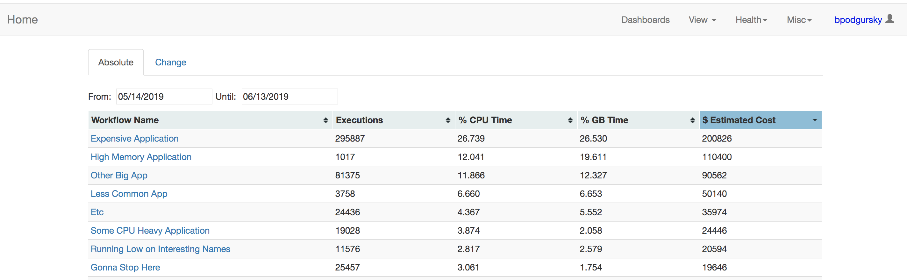

(these costs default to GCP on-demand instance costs for CPU and memory).  By aggregating CPU and RAM costs per application, we can show the aggreate cost per application across an environment.

We can also track global data read and written:

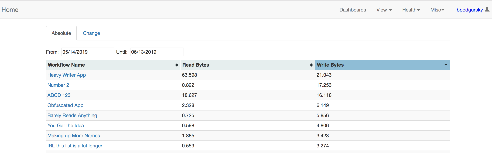

and HDFS metadata operations (eg, NameNode calls):

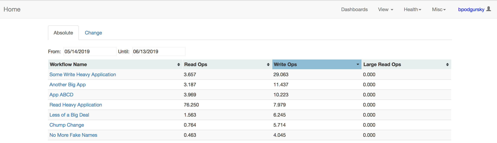

And task shuffle load:

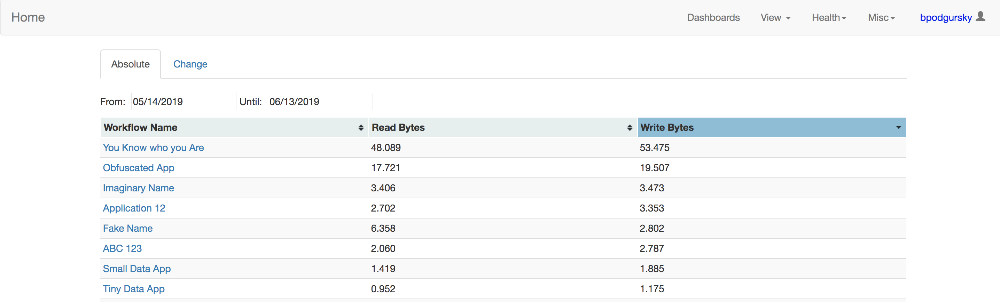

These tools make it easy to identify which applications using a disproportionate fraction of global resources.

## Non-Hadoop workflows
  
Workflow2 was built primarily to support Hadoop jobs, but it is also sometimes valuable to be able to run workflows which do not reference Hadoop, and do not have Hadoop on the classpath.  This is possible using using `BaseStep`, `BaseAction`, and `BaseWorkflowRunner`, which are available via the `workflow_core` and `workflow_state` Maven artifacts (which, unlike `workflow_hadoop`, have no Hadoop dependencies):
  
```java
public class NoOpBaseAction extends BaseAction<Void> {

  public NoOpBaseAction(String checkpointToken) {
    super(checkpointToken);
  }

  @Override
  protected void execute() throws Exception {
    // Deliberately do nothing.
  }
}
```
([source](workflow_examples/src/main/java/com/liveramp/workflow2/workflow_examples/actions/NoOpBaseAction.java))

To run the workflow, use `WorkflowDbRunners.baseWorkflowDbRunner`:

```java
    BaseStep<Void> step1 = new BaseStep<>(new NoOpBaseAction("step1"));
  
    BaseStep<Void> step2 = new BaseStep<>(new NoOpBaseAction("step2"), step1);
  
    WorkflowDbRunners.baseWorkflowDbRunner(
        SimpleNonHadoopWorkflow.class,
        CoreOptions.test(),
        step2
    );

```
([source](workflow_examples/src/main/java/com/liveramp/workflow2/workflow_examples/SimpleNonHadoopWorkflow.java))

This workflow runs against the database, but does not support Hadoop-specific integrations.

## Workflow UI

The UI has many tracking and analytics features for analyzing application performance; this is not an exhaustive list, but a few of the more commonly used ones.

#### Dashboards

The Workflow UI is built to be useful even with a large number of users and applications -- we expect that not ever engineers cares about the health of every application.
 
The first thing we can do is set up a Dashboard for the applications we care about.  This gives us a combined view of the Executions  of these applications on a single page.  We can create and configure a dashboard to include particular applictions:

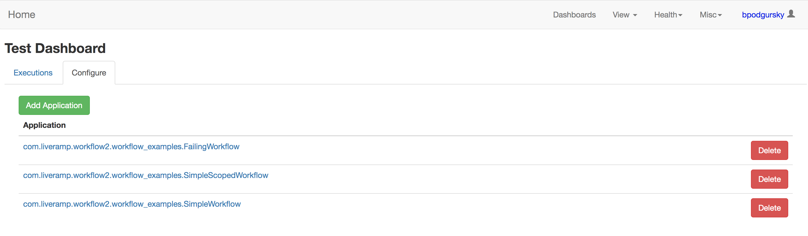

And then the dashboard will show all (time-bounded) running and complete executions for those apps:

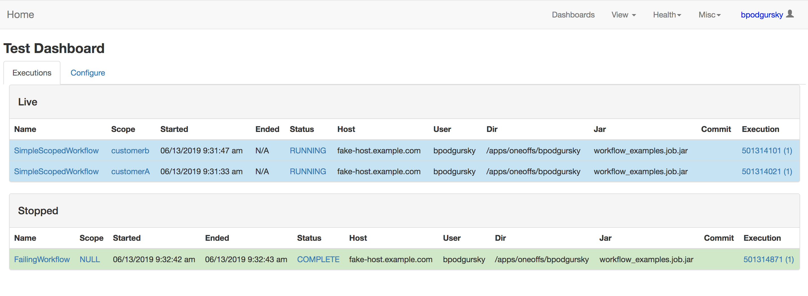

Dashboards aren't specific to an individual.  To customize your default homepage, you can add links to specific dashboards:

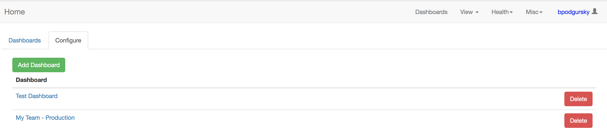

Then on the homepage, your default view will be a summary of the applications configured in a given dashboard:

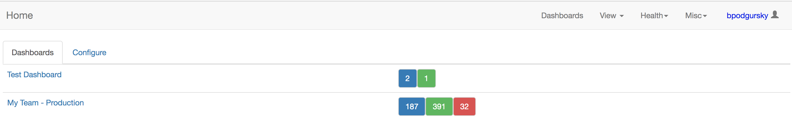

(in this case, we can see that our new dashboard has 2 running and 1 complete application).

#### Manual operations

The UI has a few tools for manually manipulating workflows if necessary.  If we want to force a workflow to re-run a step on the next attempt, we can _revert_ a step:

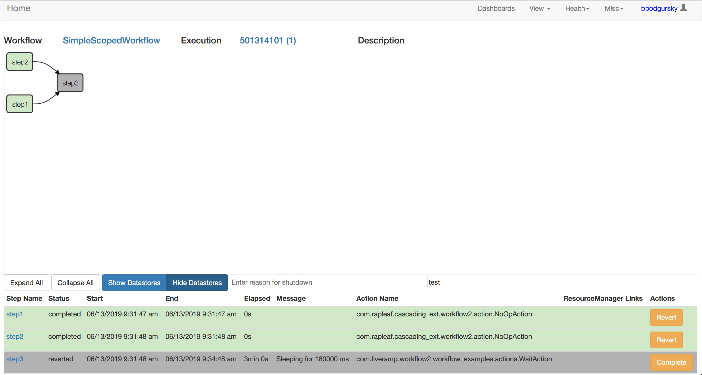

This step will be re-run when the workflow resumes.  If we want to for the workflow to _skip_ a step, we can manually _complete_ a step:

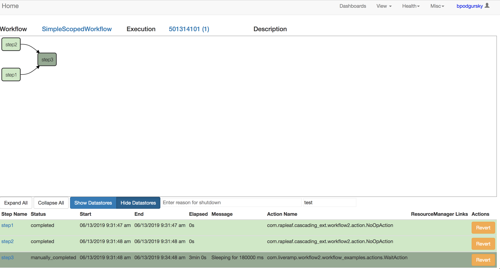

The next time the workflow runs, it will not attempt to run this step.

If we want to stop a workflow mid-execution (for example, to deploy a new version of the code halfway through, we can _request shutdown).  This will end the attempt gracefully -- pending steps will finish, but no new steps will complete:


#### Notifications

Workflow2 has configurable email notifications.  We can configure arbitrary email addresses to receive failure or success notifications for a given application:

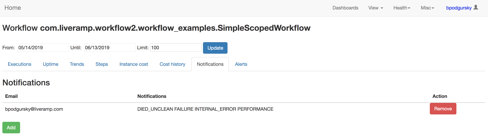

(the full list of options are START, SUCCESS, FAILURE, SHUTDOWN, INTERNAL_ERROR, STEP_FAILURE, STEP_SUCCESS, DIED_UNCLEAN, and PERFORMANCE).

Unfortunately (making this configuration less involved is a TODO), the executor needs to configure an AlertsHandlerFactory to send these emails.  We can define one like this:

```java
  public static class MailerHelperHandlerFactory implements AlertsHandlerFactory {
    @Override
    public AlertsHandler buildHandler(Set<String> emails, MailBuffer buffer) {
      return new MailerHelperAlertsHandler(new GenericAlertsHandlerConfig(
          new DefaultAlertMessageConfig(false, Lists.newArrayList()),
          "noreply",
          "example.com",
          new StaticEmailRecipient("target@example.com")
      ), new SmtpConfig("mailserver.example.com", Duration.ofMinutes(5l)));
    }
  }

```

and set it directly on the options:

```java
    WorkflowRunners.dbRun(
        AlertsHandlerWorkflow.class.getName(),
        HadoopWorkflowOptions.test()
            .setAlertsHandlerFactory(new MailerHelperHandlerFactory())
            .setScope(args[0]),
        dbHadoopWorkflow -> Sets.newHashSet(step3)
    );
```

## Workflow Monitor

The Workflow Monitor is a tool built-into Workflow2 which identifies badly-performing Hadoop applications and alerts the relevant teams.  These alerts are all powered by MapReduce counters.  The thresholds are currently hard-coded, but making the limits configurable is a planned future improvement.  The default enabled alerts are:

- [CPUUsage](workflow_monitor/src/main/java/com/liveramp/workflow_monitor/alerts/execution/alerts/CPUUsage.java).  If an application uses more than 2x the CPU it has requested from YARN, it probably indicates heavy Garbage Collection (and definitely indicates an abuse of shared resources)
- [GCTime](workflow_monitor/src/main/java/com/liveramp/workflow_monitor/alerts/execution/alerts/GCTime.java) If an application is spending more than 25% of its CPU time on Garbage Collection, this indicates wasted CPU
- [InputPerReduceTask](workflow_monitor/src/main/java/com/liveramp/workflow_monitor/alerts/execution/alerts/InputPerReduceTask.java) Excessively high input per reduce task can cause disk problems.
- [KilledTasks](workflow_monitor/src/main/java/com/liveramp/workflow_monitor/alerts/execution/alerts/KilledTasks.java) If more than 50% of an application's tasks are killed, we probably need to adjust YARN queues to reduce preemption.
- [OutputPerMapTask](workflow_monitor/src/main/java/com/liveramp/workflow_monitor/alerts/execution/alerts/OutputPerMapTask.java) If map tasks on average output over 8GB of data, this can cause problems when merging spill files.
- [ShortMaps](workflow_monitor/src/main/java/com/liveramp/workflow_monitor/alerts/execution/alerts/ShortMaps.java) If map tasks average < 2 minutes, the application is spending an unreasonable amount of time just starting and stopping tasks, and not enough time actually doing computation.
- [ShortReduces](workflow_monitor/src/main/java/com/liveramp/workflow_monitor/alerts/execution/alerts/ShortReduces.java) Likewise, if reduces average < 2 minutes, the application is spending too much time on task overhead.

The last alert is not MapReduce specific:

- [DiedUnclean](workflow_monitor/src/main/java/com/liveramp/workflow_monitor/alerts/execution/alerts/DiedUnclean.java) Because an OOM killed process cannot alert that  it has died (obviously), the WorkflowMonitor asynchronously notifies users that their applications have died unexpectedly.

#### Officer Elephant

Alerts per-job can work if applications run at low cadence (eg, once a day).  If applications run 10,000 times a day, getting alerts per application is overwhelming, and often not actionable (eg, if only .1% of an application's jobs have high GC, we don't want to increase heap size across the board).  So we built an interface on the Workflow UI (health -> Officer Elephant) to expose the alerts aggregated by application and type:


This quickly identifies which applications can be fixed for the greatest immediate global impact.

#### Task Exceptions

Because MapReduce and Spark jobs are launched directly through the Action class, we're able to use the instrumentation there to sample all task failures on the cluster.  We can break this data down in a few ways; one of the most useful is a list of _where_ tasks failures have happened:


This can help quickly identify whether bad hardware is responsible for application failures.


## Background Workflow

Workflow2 works well for most of LiveRamp's big data applications, but because workflows are launched as persistent JVMs, there are a number of use-cases where workflow does _not_ perform well: 

- As a service coordinator, where Actions wait for long-lived external requests to complete

- As a work queue; once an Execution is running, it is consuming resources

- If a workflow has enough large in-memory concurrent steps that the work needs to be distributed.

BackgroundWorkflow is a redesign of Workflow2 which avoids these limitations by using persistent workers processes - workflow submission is "fire and forget".

The Background Workflow implementation here works, _but_:

- Is still alpha; the API is not set in stone

- Does not yet support Hadoop integration (this is still in progress)

Background Workflow fully integrates with the Workflow UI, but the job submission and execution model is very different; for more details, please see [BackgroundWorkflow.md](BackgroundWorkflow.md).

## Getting started

### Simple Kubernetes deployment

The UI, Monitor and database setup are all published as [Docker](https://www.docker.com/) containers, available via Dockerhub (See the [UI](https://hub.docker.com/r/liveramp/workflow2_ui), [Monitor](https://hub.docker.com/r/liveramp/workflow2_monitor), and database [setup](https://hub.docker.com/r/liveramp/workflow2_db_migrations)).

To make things easy, we've set up an example [Kubernetes manifest](kubernetes/demo_manifest.yaml) which spins up a demonstration Workflow2 deployment:
 - A MySQL server for the system state
 - The Workflow UI, with an init container (workflow2_db_migrations) which runs database migrations
 - The Workfow Monitor
 - A simple example workflow which runs on a one-minute cron
 
To run this demo, you'll need `kubectl` wired into a Kubernetes cluster (if you don't have a remote Kubernetes cluster available, you can use [minikube](https://kubernetes.io/docs/setup/learning-environment/minikube/)).  Apply the demonstration manifest:

```bash
kubectl apply -f kubernetes/demo_manifest.yaml
```

This creates all the resources described above.  We'll want to set up port-forwarding so we can view the UI locally:

```bash
kubectl port-forward svc/workflow2-ui 8080:8080
```

Now you can reach the UI locally by navigating to `http://127.0.0.1:8080/global.html`.  Log in with the dummy credentials from the manifest (admin/admin), and you can see the example workflow running:

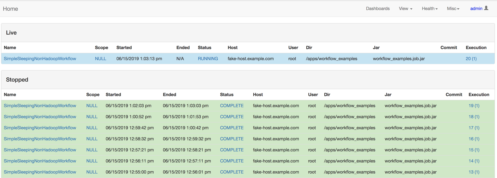

That's it!  To see more details on how the example workflow runs, check out the comments in the manifest and the workflow_examples [Dockerfile](workflow_examples/Dockerfile).

__Important__: This manifest is not production-ready!  A stable production deployment will want:
 - A high-availability database (you'll likely want to use a managed solution like RDS or CloudSQL instead of the simple containerized database here)
 - Real database credentials!  For simplicity, the root password is used here for all applications.  In a real deployment, only the workflow2_db_migrations container needs ALTER privileges.  Other services (clients, ui, and monitor) only need INSERT,SELECT,UPDATE, and DELETE.
 - Secrets (eg, yml files with passwords) stored as actual K8s secrets, not as ConfigMaps.  The config files are ConfigMaps only for visibility.
 - SSL in front of the UI.

### Maven artifacts

Workflow2 artifacts are published to Maven Central:

```xml
  <dependency>
    <groupId>com.liveramp.workflow2</groupId>
    <artifactId>workflow_hadoop</artifactId>
    <version>1.0</version>
  </dependency>
```

Snapshots builds are also are published to Sonatype:

```xml
    <repository>
      <id>oss.sonatype.org-snapshot</id>
      <url>http://oss.sonatype.org/content/repositories/snapshots</url>
      <releases>
        <enabled>false</enabled>
      </releases>
      <snapshots>
        <enabled>true</enabled>
      </snapshots>
    </repository>
  </repositories>
  
  <dependency>
    <groupId>com.liveramp.workflow2</groupId>
    <artifactId>workflow_hadoop</artifactId>
    <version>1.0-SNAPSHOT</version>
  </dependency>
```

Snapshot builds will be based on the latest master commits, but have no promise of API stability.

## FAQ

#### Is this README comprehensive?

Not even close.  Workflow2 has a _lot_ of hooks and knobs for tuning, visibility, and custom behavior.  It's well tested, but not well documented (yet).  If you think there's a feature workflow2 should have, please put up an issue and ask!

#### Why is it called workflow2?

"Workflow" was already a bit overloaded.

#### Why doesn't the packaging line up with the maven artifacts?

Workflow2 is very widely used within LiveRamp, and repackaging would be a massive undertaking across our codebase; we prioritized OSSing the project over a 100% cleanup effort.  In a future major release we plan on aligning the packaging with the maven artifacts.

#### Did this project really start on June 4, 2019?

No.  Unfortunately, Workflow2 was entangled with our internal codebase, so we couldn't release the git history without also releasing proprietary code.  Workflow2 has been in development internally for many years, and gone through many iterations. 

#### How can I contribute / get help / report bugs / learn more?

We love contributions!  The best way to get in touch is to create a ticket or a pull request.


## License
[](https://app.fossa.io/projects/git%2Bgithub.com%2Fliveandrew%2Fworkflow2?ref=badge_large)